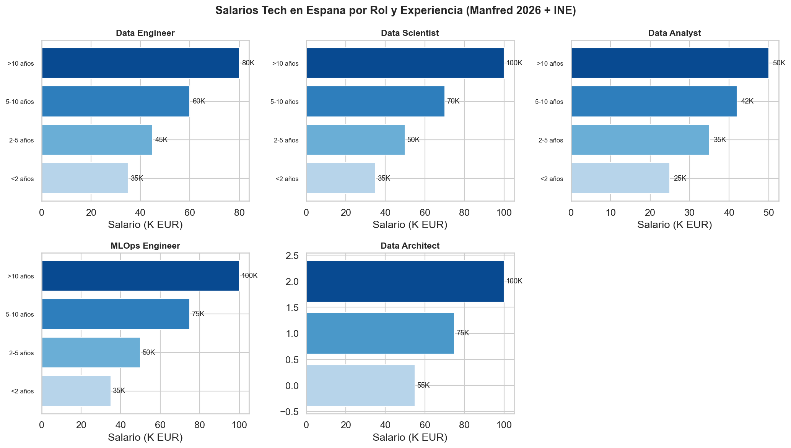

# Pearsons Four — EDA Data Science Job Salaries

<p align="center">
  
</p>

**Exploratory Data Analysis: LinkedIn job postings + Stack Overflow bias analysis + Spain tech salary study for DataTalent Solutions S.L.**

---

## Team

| Rol | Nombre | GitHub |
|-----|--------|--------|
| **Responsable de Ingeniería de Datos** (Data Wrangler) — Fases 1 & 2 | **Juan** | [@juandelaf1](https://github.com/juandelaf1) |
| **Responsable de Análisis Estadístico** — Fase 3 | **Isabela** | [@Isabela-Tellez](https://github.com/Isabela-Tellez) |
| **Responsable de Visualización** (Data Storyteller) — Fase 4 | **Anas** | [@Anasfady](https://github.com/Anasfady) |
| **Consultora de Estrategia y Ética de Datos** — Sesgos | **Vanessa** | [@garciaguadalupevanessa-bit](https://github.com/garciaguadalupevanessa-bit) |

> **Scrum Master:** Anas | **Product Owner:** Juan

---

## Project Context

DataTalent Solutions S.L., an HR consultancy specializing in tech profiles, needs **empirical evidence** on which technical skills are in demand in the Spanish data job market. This project performs a full EDA across **two datasets** and a **complete Spain market study** to answer:

1. Most frequently demanded technical skills in data roles
2. Salary distribution biases (experience, remote work, location)
3. Industry sectors with more offers and competitive salaries
4. Correlations between experience, skills, and salary
5. How incomplete or biased data could lead to wrong business decisions
6. **What is the real tech salary landscape in Spain?** (market study)

---

## Datasets

| Dataset | Source | Rows | Purpose |
|---------|--------|------|---------|
| **LinkedIn Job Postings** | Kaggle (arshkon) | 123,849 | Main EDA: job market, salaries, skills, industries |
| **Stack Overflow Developer Survey 2025** | Stack Overflow | 49,191 | Bias analysis: demographic representation, MNAR, conditional probability |
| **Spain Tech Salaries** | Manfred 2026 + INE + Glassdoor + Tecnoempleo + Ticjob + InfoJobs + Indeed | 149 salaries + 77 offers | Spain-specific market analysis |

---

## Repository Structure

```
Pearsons_Four/
├── .github/workflows/ci.yml       # CI pipeline (GitHub Actions)
├── dashboard/
│   └── app.py                      # Streamlit interactive dashboard
├── screenshots/                    # Banner + graph captures
│   ├── linkedin_*.png              # LinkedIn visualizations
│   ├── vgg_*.png                   # Bias analysis visualizations
│   └── espana/                     # Spain study graphs
├── docs/
│   ├── GUIDE.md                    # Team handbook with task distribution
│   ├── PROYECTO_DETALLADO.md       # Standalone project methodology
│   ├── GUION_DEFENSA_COMPLETO.md   # Defense script
│   ├── GUIA_METRICAS_Y_CAMBIOS.md  # Metrics correction guide
│   ├── informes/                   # Detailed reports
│   └── trello_template.json
├── notebooks/
│   ├── Pearsons_Four_EDA_Linkedin.ipynb         # LinkedIn full EDA
│   ├── Pearsons_Four_EDA_Enhanced.ipynb         # Corrected metrics version
│   ├── VGGPearsonsFour.ipynb                    # Bias analysis (SO + Cross-dataset)
│   └── espana/
│       ├── Pearsons_Four_Enhanced.ipynb         # Spain enhanced correlations
│       ├── Spain_EDA_Integrated.ipynb           # Spain integrated EDA
│       └── Spain_EDA_Integrated_executed.ipynb  # Executed version
├── scripts/
│   ├── pipeline/                   # Modular data pipeline
│   │   ├── config.py               # Unified schema, roles, categories
│   │   ├── clean_normalize.py      # Cleaning & normalization
│   │   ├── enrich_countries.py     # Country metadata enrichment
│   │   ├── load_kaggle_ds.py       # Kaggle DS loader
│   │   ├── load_linkedin.py        # LinkedIn data loader
│   │   └── load_spain.py          # Spain data loader
│   ├── generate_visualizations.py  # Generates all graphs
│   ├── scrape_spain_salaries.py    # Modular scraper (5 sources)
│   ├── build_real_salary_pipeline.py  # INE + Manfred pipeline
│   ├── verify_all_metrics.py       # Statistical verification
│   └── verify_salaries.py          # Salary verification
├── data/
│   ├── linkedin_data_roles_procesed.csv   # Cleaned LinkedIn data
│   └── espana/                            # Spain salary data (17 files)
├── slides/
│   ├── presentacion_pearsons_four.pptx    # Main presentation
│   └── extras/                            # Additional slide decks
├── tests/                          # Unit tests
│   ├── test_config.py
│   ├── test_clean_normalize.py
│   └── test_enrich_countries.py
├── pyproject.toml                  # Project config + dependencies
├── run_all.ps1                     # E2E pipeline orchestrator
└── README.md
```

---

## Key Findings

### 1. Data Wrangling (Juan)

| Metric | LinkedIn Dataset |
|--------|-----------------|
| Rows / Columns | 123,849 × 31 |
| Total nulls | 1,269,564 (70.87% in salaries) |
| Duplicates | 0 |
| Data role postings | 1,831 (1.5% of total) |
| Outliers (IQR) | 14 (2.3% of salaried) |
| **Clean records** | **616** with reliable salaries |

### 2. Statistical Analysis (Isabela) — Data Roles Only

> **Note:** Metrics below are calculated exclusively on **Data Roles** (616 cleaned records).
> The original +45.1% remote premium was calculated on all LinkedIn postings (every profession).
> When isolating Data Roles, the premium disappears.

| Metric | LinkedIn (Data Roles) |
|--------|----------------------|
| **Mean salary** | $142,936 |
| **Median salary** | $136,422 |
| Salary range | $35,360 – $265,000 |
| **Remote premium (Data Roles)** | **-1.2%** (p=0.46, not significant) |

**Experience vs Salary (Median):**
| Level | Median Salary |
|-------|-------------|
| Entry Level | $114,938 |
| Associate | $97,500 |
| Mid-Senior | $140,400 |
| Director | $212,500 |
| Executive | $222,500 |

**Correlation Analysis:**
| Variable Pair | Pearson r | Interpretation |
|--------------|-----------|----------------|
| Experience → Salary | **0.49** | Moderate-strong positive. **Main finding.** |
| Remote → Salary | **0.04** | Near zero. No relationship for Data Roles. |
| Views → Applies | **0.91** | Strong positive. |
| Views → Salary | **-0.15** | Very weak negative. |

**ANOVA:** F = 43.79, **p < 0.00001** → Experience significantly affects salary.

### 3. Visualizations (Anas)

11 graphs: histogram+KDE, boxplot by experience, salary progression, CDF, remote premium, top roles, views vs applies, dashboard panels.

<p align="center">
  
  
  
</p>

### 4. Stack Overflow — Bias Analysis (Vanessa)

| Bias Type | Finding |
|-----------|---------|
| **Geographic** | US/UK overrepresented; 0 Spain postings in LinkedIn data |
| **Salary MNAR** | 70.87% missing; 47.33% juniors hide vs 23.86% seniors |
| **Selection Bias** | 83.81% Senior vs 16.19% Junior/Early-Career |
| **Skills sparsity** | 98.03% missing `skills_desc` column |

### 5. Cross-Dataset Comparison

| Metric | Stack Overflow | LinkedIn |
|--------|---------------|----------|
| Median salary | $85,000 | **$135,588** |
| Perspective | Developer self-reported | Corporate real offers |

**Key insight:** LinkedIn offers reflect +59% median vs SO survey. Price programs on LinkedIn data.

---

## Spain Tech Market Study

In addition to the team's work, this repository includes a **complete analysis of the Spanish tech salary market**, sourcing data from:

| Source | Type | Records |
|--------|------|---------|
| **Manfred 2026 Salary Guide** | Salary ranges by role & experience | 80 |
| **INE (Instituto Nacional de Estadística)** | Official sector J data (2008-2024) | 51 |
| **Glassdoor** | User-reported salaries | 18 |
| **Tecnoempleo** | Active job offers | ~30 |
| **Ticjob** | Active job offers | ~20 |
| **InfoJobs + Indeed** | Archived offers | ~40 |

### Key Spain Findings

- **INE Sector J (2024):** €42,742 avg tech salary vs €29,540 national average (+44.7% premium)
- **Regional variation:** Madrid (€35,170) and Cataluña (€31,730) lead; Extremadura (€23,194) and Canarias (€25,052) lag
- **Manfred 2026 data ranges:** Data Scientist: €25K-75K, Data Engineer: €26K-78K, Data Analyst: €22K-55K
- **Regional multipliers** computed from INE Table 28191 for location-based salary estimation

### Spain Visualizations

<p align="center">
  
</p>

19 Spain-specific graphs available in `screenshots/espana/`.

---

## Pipeline & Reproducibility

This project uses **uv** for dependency management. To reproduce:

```bash
# Install dependencies
uv sync

# Run full pipeline
.\run_all.ps1                     # E2E on Windows
uv run python scripts/generate_visualizations.py   # Generate graphs
uv run python scripts/verify_all_metrics.py        # Verify stats

# Run tests
uv run pytest tests/ -v

# Launch dashboard
uv run streamlit run dashboard/app.py
```

### Data Pipeline Modules

The `scripts/pipeline/` module provides a reusable data pipeline:

- **config.py** — Unified schema, role categories, experience maps, regions
- **load_linkedin.py** — LinkedIn data loading (local CSV or Kaggle fallback)
- **load_kaggle_ds.py** — Kaggle DS Salaries dataset loader
- **load_spain.py** — Spain salary data loader (scraped + official INE)
- **clean_normalize.py** — Cleaning, normalization, IQR outlier detection
- **enrich_countries.py** — Country metadata (GDP, PPP, coordinates)

---

## Dashboard

An interactive **Streamlit dashboard** is available at `dashboard/app.py`:

```
uv run streamlit run dashboard/app.py
```

Features: LinkedIn salary explorer, Spain market analysis, correlation viewer, bias analysis panel.

---

## Methodology

- **GitHub Flow**: feature branches → PR → review → merge to main
- **CI/CD**: GitHub Actions validates tests + notebook integrity on push
- **Dependency management**: uv + pyproject.toml for reproducible builds
- **Pair Programming**: rotating pairs every 30 min
- **Daily standup**: 5 min, 3 questions (led by SM)

---

## Deliverables Status

| Deliverable | Owner | Status |
|------------|-------|--------|
| LinkedIn Job Postings EDA notebook | Juan + Isabela + Anas | ✅ Complete |
| Stack Overflow bias analysis notebook | Vanessa | ✅ Complete |
| Cross-dataset comparison | Vanessa | ✅ Complete |
| Executive presentation (10 min slides) | Isabela | ✅ Complete |
| README with results | Anas | ✅ Complete |
| GUIDE.md with task distribution | Anas | ✅ Complete |
| **Spain tech salary study** | Juan | ✅ Complete |
| **Modular data pipeline** | Juan | ✅ Complete |
| **Interactive dashboard** | Juan | ✅ Complete |
| **CI/CD + Tests** | Juan | ✅ Complete |

---

## License

Educational project — Module II: Data Analysis & Visualization
*Pearsons Four — May/June 2026*
