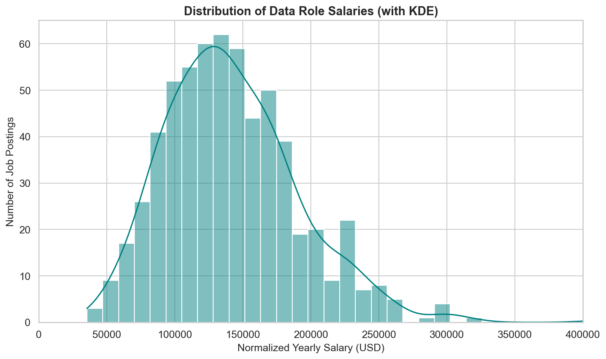
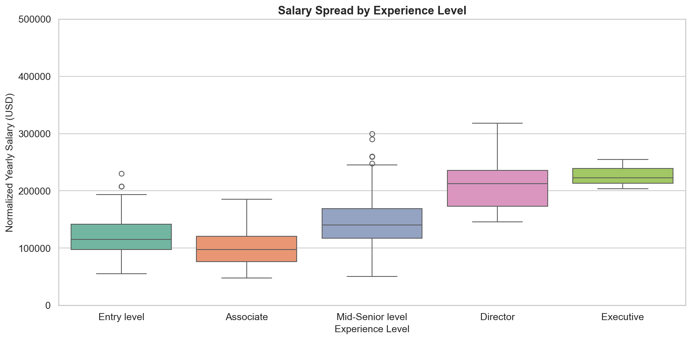
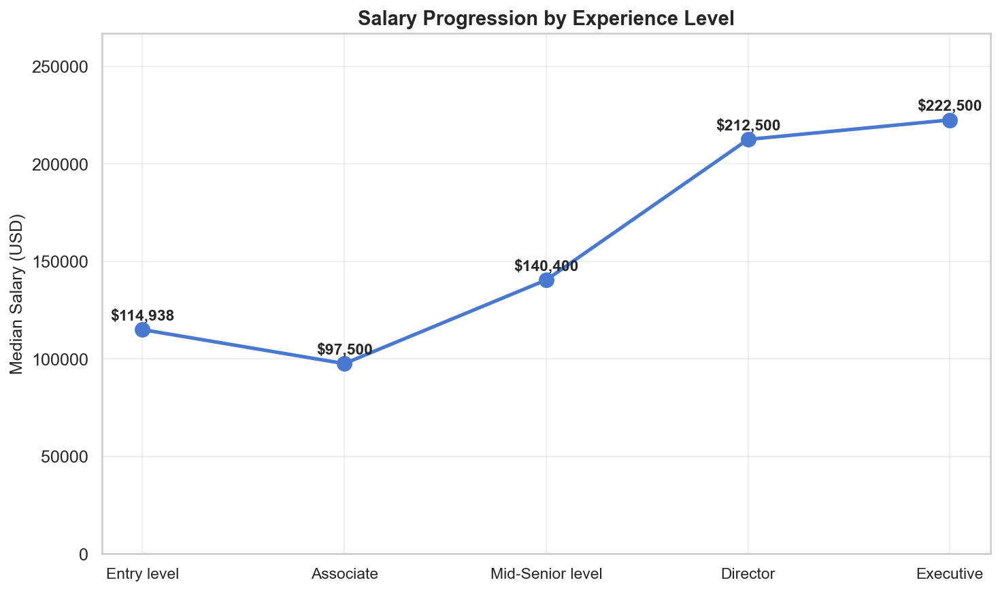
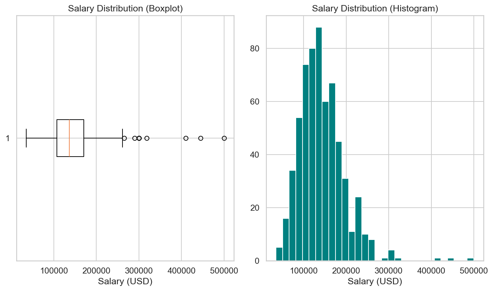
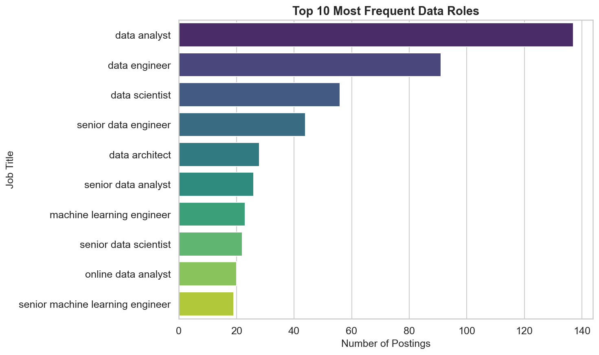
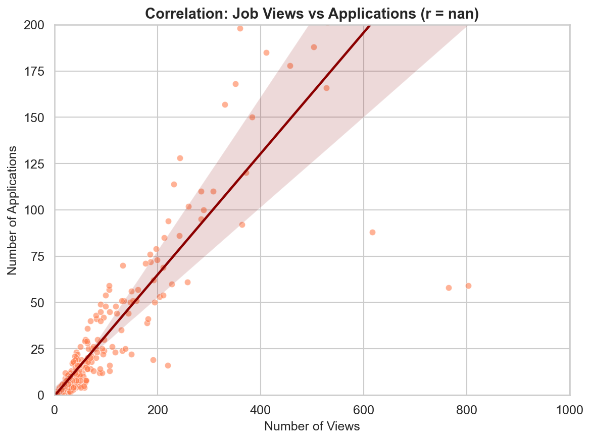
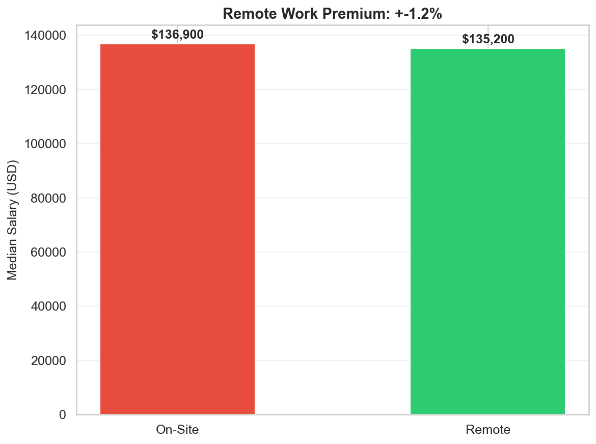
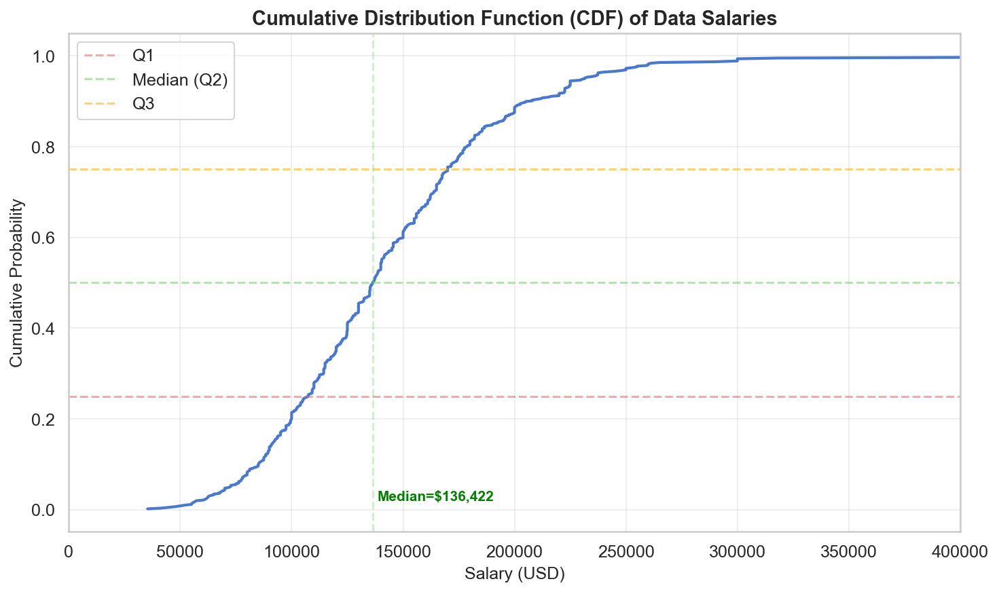

# Pearsons Four — EDA Data Science Job Salaries

<p align="center">
  
</p>

**Exploratory Data Analysis: LinkedIn job postings + Stack Overflow bias analysis for DataTalent Solutions S.L.**

---

## Team

| Rol | Nombre | GitHub |
|-----|--------|--------|
| **Responsable de Ingeniería de Datos** (Data Wrangler) — Fases 1 & 2 | **Juan** | [@juandelaf1](https://github.com/juandelaf1) |
| **Responsable de Análisis Estadístico** — Fase 3 | **Isabela** | [@Isabela-Tellez](https://github.com/Isabela-Tellez) |
| **Responsable de Visualización** (Data Storyteller) — Fase 4 | **Anas** | [@Anasfady](https://github.com/Anasfady) |
| **Consultora de Estrategia y Ética de Datos** — Sesgos | **Vanessa** | [@garciaguadalupevanessa-bit](https://github.com/garciaguadalupevanessa-bit) |

> **Scrum Master:** Anas | **Product Owner:** Juan

---

## Project Context

DataTalent Solutions S.L., an HR consultancy specializing in tech profiles, needs **empirical evidence** on which technical skills are in demand in the Spanish data job market. This project performs a full EDA across **two datasets** to answer:

1. Most frequently demanded technical skills in data roles
2. Salary distribution biases (experience, remote work, location)
3. Industry sectors with more offers and competitive salaries
4. Correlations between experience, skills, and salary
5. How incomplete or biased data could lead to wrong business decisions

---

## Datasets

| Dataset | Source | Rows | Purpose |
|---------|--------|------|---------|
| **LinkedIn Job Postings** | Kaggle (arshkon) | 123,849 | Main EDA: job market, salaries, skills, industries |
| **Stack Overflow Developer Survey 2025** | Stack Overflow | 49,191 | Bias analysis: demographic representation, MNAR, conditional probability |

---

## Repository Structure

```
Pearsons_Four/
├── screenshots/                 # Banner + graph captures
│   └── banner.png
├── docs/
│   ├── GUIDE.md                 # Team handbook with task distribution
│   └── trello_template.json
├── notebooks/
│   ├── Pearsons_Four_EDA_Linkedin.ipynb              # LinkedIn EDA (full, Juan + Isabela + Anas)
│   └── VGGPearsonsFour.ipynb                         # Bias analysis (Stack Overflow + Cross-dataset, Vanessa)
├── data/
│   └── linkedin_data_roles_procesed.csv              # Cleaned LinkedIn data roles
├── slides/
│   └── presentacion_pearsons_four.pdf                # Executive presentation
├── .github/
│   └── ISSUE_TEMPLATE/
│       └── task.md
└── README.md
```

---

## Key Findings

### 1. Data Wrangling (Juan)

| Metric | LinkedIn Dataset |
|--------|-----------------|
| Rows / Columns | 123,849 × 31 |
| Total nulls | 1,269,564 (70.87% in salaries) |
| Duplicates | 0 |
| Data role postings | 1,831 (1.5% of total) |
| Outliers (IQR) | 14 (2.3% of salaried) |
| Outliers (z-score) | 1 (0.2%) |
| **Decision** | Removed salaries < $1K and > $2M |

**Key normalization applied:**
- `.str.lower().str.strip()` on `title`, `location`, `company_name`
- Experience levels mapped to numeric: Internship=0 through Executive=5
- City extracted from location field
- IQR filter: kept 607 clean records with reliable salaries

### 2. Statistical Analysis (Isabela) — Data Roles Only

> **Note:** Metrics below are calculated exclusively on **Data Roles** (616 cleaned records).  
> The original +45.1% remote premium and r=0.62 views-applies correlation were calculated on all LinkedIn postings (every profession).  
> When isolating Data Roles, the remote premium disappears and the views-applies correlation strengthens.

| Metric | LinkedIn (Data Roles) |
|--------|----------------------|
| Clean records for analysis | 616 |
| **Mean salary** | $142,936 |
| **Median salary** | $136,422 |
| Salary range (IQR-cleaned) | $35,360 – $265,000 |
| **Remote premium (Data Roles)** | **-1.2%** (Remote: $135,200 vs On-site: $136,900) — Not significant (p=0.46) |
| **Remote premium (All LinkedIn)** | +45.3% — Context: all professions, where on-site roles include lower-paid occupations |

**Experience vs Salary (Median):**
| Level | Median Salary |
|-------|-------------|
| Entry Level | $114,938 |
| Associate | $97,500 |
| Mid-Senior | $140,400 |
| Director | $212,500 |
| Executive | $222,500 |

**Correlation Analysis:**
| Variable Pair | Pearson r | Spearman ρ | Interpretation |
|--------------|-----------|------------|----------------|
| Experience level → Salary | **0.49** | **0.50** | Moderate-strong positive. **Main finding.** |
| Remote allowed → Salary | **0.04** | **0.08** | Near zero. No relationship for Data Roles. |
| Views → Applies | **0.91** | — | Strong positive. More views = more applications. |
| Views → Salary | **-0.15** | **-0.17** | Very weak negative. Traffic ≠ salary. |

**Hypothesis Testing (ANOVA):**
- F = 43.79, **p < 0.00001** → **Experience level significantly affects salary** (reject H₀)

**Conditional Probability (LinkedIn):**
- Could not be reliably calculated: **98.03%** of `skills_desc` are null in LinkedIn
- Python/other skill probabilities come from **Stack Overflow** analysis (Vanessa's section)

### 3. Visualizations (Anas)

11 graphs created in the enhanced notebook, all with professional titles, axis labels, footnotes, and Markdown interpretation:

<p align="center">
  
  
  
</p>
<p align="center">
  
  
  
</p>
<p align="center">
  
  
  
</p>

- **Histogram + KDE:** Salary distribution is positively skewed — most roles cluster between $80K–$160K
- **Boxplot by Experience:** Clear salary progression from Entry Level ($115K) to Executive ($223K)
- **Line Graph:** Salary progression by experience — the biggest jump is Associate → Mid-Senior (+$43K)
- **CDF:** 50% of Data roles pay between $107K and $170K (IQR)
- **Remote Premium (Data Roles):** No significant difference — both remote and on-site median ~$136K
- **Views vs Applies:** Strong positive correlation (r=0.91) — more views = more applications
- **Views vs Salary:** Near-zero correlation (r=-0.15) — traffic ≠ salary quality

### 4. Stack Overflow — Bias Analysis (Vanessa)

| Bias Type | Finding | Impact on AI |
|-----------|---------|-------------|
| **Geographic** | US/UK overrepresented; 0 postings from Spain in LinkedIn data | Model would not generalize to Spanish market |
| **Salary MNAR** | 70.87% missing salaries; 47.33% of juniors hide salary vs 23.86% seniors | Model would **underestimate** junior salaries |
| **Selection Bias** | 83.81% Senior/Experienced vs 16.19% Junior/Early-Career in sample | Algorithm penalizes junior profiles by lack of training data |
| **Skills sparsity** | 98.03% missing `skills_desc` column | Cannot reliably extract skills → use `job_skills` table instead |

**Conditional Probability (Stack Overflow):**
- P(High Salary | Senior/Experienced) = **53.42%**
- P(High Salary | Junior/Early-Career) = **22.57%**

**MNAR Evidence:**
<p align="center">
  
</p>

### 5. Cross-Dataset Comparison (Vanessa)

| Metric | Stack Overflow (Community) | LinkedIn (Marketplace) |
|--------|---------------------------|----------------------|
| Clean sample | 18,981 | 607 |
| Median salary | $85,000 | **$135,588** |
| Mean salary | $109,735 | **$139,844** |
| Perspective | Developer self-reported | Corporate real offers |

**Key insight:** LinkedIn offers reflect real market rates (+59% median vs SO survey). Programs must be priced on LinkedIn data, not inflated SO self-reports.

<p align="center">
  
</p>

---

## Methodology

- **GitHub Flow**: feature branches → PR → review → merge to main
- **Pair Programming**: rotating pairs every 30 min
- **Single Colab**: all team members work on the same notebook
- **Daily standup**: 5 min, 3 questions (led by SM)

---

## Deliverables Status

| Deliverable | Owner | Status |
|------------|-------|--------|
| LinkedIn Job Postings EDA notebook | Juan + Isabela + Anas | ✅ Complete |
| Stack Overflow bias analysis notebook | Vanessa | ✅ Complete |
| Cross-dataset comparison | Vanessa | ✅ Complete |
| Executive presentation (10 min slides) | Isabela | ✅ Complete |
| README with results | Anas | ✅ Complete |
| GUIDE.md with task distribution | Anas | ✅ Complete |

---

## License

Educational project — Module II: Data Analysis & Visualization  
*Pearsons Four — May 2026*
