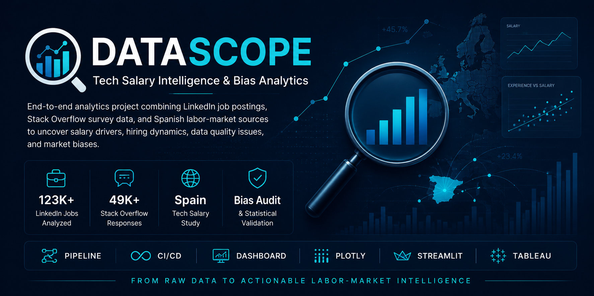

# 📡 DataScope — Multi-Source Salary Analytics

<p align="center">
  
</p>

<p align="center">
  <a href="https://github.com/juandelaf1/DataScope/actions"></a>
  <a href="https://hub.docker.com/r/juandelaf1/datascope"></a>
  <a href="https://www.python.org/"></a>
  <a href="LICENSE"></a>
  <a href="https://www.kaggle.com/juandelaf1/datascope"></a>
  <a href="https://github.com/juandelaf1/DataScope"></a>
</p>

---

## Executive Summary

| KPI | Value |
|-----|-------|
| **Unified records** | **5,370** (LinkedIn + Kaggle DS + Spain multi-source) |
| **Countries** | **50** with PPP-adjusted salary comparisons |
| **Spain median salary** | **€43,200/yr** — PPP-adjusted **$66,683 USD** |
| **Best-paid role (Spain)** | **Data Scientist** — Senior median **€61.5K** |
| **Global experience → salary** | **r = 0.49** (moderate-strong, p < 0.00001) |
| **Title normalization** | **1,037 → 15 roles**, 99.8% coverage |
| **Eurostat PPP countries** | **47** (1960-2025 population + GDP) |
| **Test coverage** | **79 tests** (70 title normalization + pipeline + CI) |
| **Dashboard** | Streamlit + Plotly interactive |

---

## Dataset Composition

| Source | Records | Geography | Year |
|--------|---------|-----------|------|
| **LinkedIn Job Postings** (Kaggle) | 1,831 | Global (US/UK centric) | 2023 |
| **Kaggle DS Salaries** | 607 | Global multi-year | 2020–2024 |
| **Manfred 2026 Salary Guide** | 2,700 | Spain (triangular sampling from published bands) | 2026 |
| **Kaggle DS 2024 Spain** | 127 | Spain | 2024 |
| **Glassdoor ES** | 105 | Spain | 2024 |
| **Eurostat PPP** | 1,268 rows × 47 countries | EU + neighbours | 1960–2025 |

> The **global unified dataset** (`data/global/global_salaries_unified.csv`) merges LinkedIn + Kaggle DS into a single schema. The **Spain 2026 dataset** (`data/espana/spain_salaries_2026_unified.csv`) combines Manfred, Glassdoor, and Kaggle ES with title normalization.

---

## Pipeline Architecture

```
LinkedIn ─┐
Kaggle DS ─┤ → load_global_salaries.py → global_salaries_unified.csv
Spain ─────┘                              │
                                          ├──→ DuckDB analytics (5 SQL queries)
                                          │     ├── 01_median_salary_by_role
                                          │     ├── 02_median_salary_by_country
                                          │     ├── 03_seniority_premium
Manfred 2026 ─┐                            │     ├── 04_top_roles_by_country
Kaggle ES ────┤ → load_spain_2026.py       │     └── 05_market_sizing
Glassdoor ES ─┘                             │
                                          └──→ Streamlit dashboard
Eurostat ──────→ load_eurostat.py → ppp_rates.csv → PPP-adjusted analysis
```

### Key scripts

| Script | Purpose |
|--------|---------|
| `scripts/load_global_salaries.py` | Unified global dataset builder (LinkedIn + Kaggle + Spain) |
| `scripts/load_spain_2026.py` | Spain multi-source loader (Manfred + Kaggle + Glassdoor) |
| `scripts/load_eurostat.py` | Eurostat TSV downloader + PPP rate computation |
| `scripts/normalize_titles.py` | Title normalization (1,037 → 15 roles, seniority extraction, threshold grouping) |
| `scripts/run_analytics.py` | DuckDB analytics engine (5 queries) |
| `dashboard/app.py` | Streamlit interactive dashboard |

---

## Key Findings

### Spain Market (2026)
- **Data Scientist** is Spain's best-paid data role (Senior median: **€61.5K**)
- **Spain median salary:** €43,200/yr raw → **$66,683 USD PPP-adjusted** (+54% vs EU average)
- **Manfred 2026** dominates the Spain dataset (92%) but is also the most current and Spain-specific

### Global Patterns
- **Experience → Salary:** r = **0.49** — dominant factor across all roles
- **Remote premium:** −1.2% (p = 0.46) — no significant effect for data roles
- **Views → Applies:** r = **0.91** — visibility drives applications
- **Salary MNAR:** 70.87% missing; juniors disproportionately affected (47.33% hide vs 23.86% seniors)

### Methodological Correction
Initial analysis used all LinkedIn professions (~75K salaries). **Corrected metrics** isolate **Data Roles only** (1,831 records):

| Metric | All Professions | Data Roles Only |
|--------|----------------|-----------------|
| Remote premium | +45.1% | **−1.2%** (p=0.46) |
| Views → Applies | r = 0.62 | **r = 0.91** |
| Experience → Salary | r = 0.43 | **r = 0.49** |

---

## Interactive Dashboard

```bash
uv run streamlit run dashboard/app.py
```

Or with Docker:

```bash
docker compose up
```

Five tabs: LinkedIn Salaries → Global Unified → Spain 2026 → Analytics → Bias Analysis.

---

## Local Setup

```bash
# Clone
git clone https://github.com/juandelaf1/DataScope.git
cd DataScope

# Install with uv
uv sync

# Run the full pipeline (optional — data is pre-computed)
uv run python scripts/load_global_salaries.py
uv run python scripts/run_analytics.py

# Launch dashboard
uv run streamlit run dashboard/app.py

# Run tests
uv run pytest tests/ -v
```

---

## Docker Deployment

```bash
# Build and run
docker compose up

# Or pull from DockerHub
docker pull juandelaf1/datascope
docker run -p 8501:8501 juandelaf1/datascope
```

Then open [http://localhost:8501](http://localhost:8501).

---

## Tech Stack

| Category | Tools |
|----------|-------|
| **Language** | Python 3.11 |
| **Data** | pandas, numpy, DuckDB |
| **Analytics** | DuckDB SQL, scipy |
| **Visualization** | Plotly, Streamlit |
| **Scraping** | scrapling (Chrome TLS impersonation) |
| **Eurostat** | Custom TSV downloader (`load_eurostat.py`) |
| **Pipeline** | uv, modular Python scripts |
| **CI/CD** | GitHub Actions (79 tests) |
| **Deployment** | Docker, docker-compose |
| **Dataset** | Kaggle (global + Spain) |

---

## Project Structure

```
DataScope/
├── .github/workflows/ci.yml           # CI pipeline (79 tests)
├── dashboard/app.py                    # Streamlit interactive dashboard
├── Dockerfile + docker-compose.yml     # Containerized deployment
├── notebooks/
│   ├── datascope_eda_linkedin.ipynb
│   ├── datascope_eda_enhanced.ipynb
│   ├── datascope_bias_analysis.ipynb
│   └── datascope_audit.ipynb
├── scripts/
│   ├── load_global_salaries.py         # Global dataset builder
│   ├── load_spain_2026.py              # Spain multi-source loader
│   ├── load_eurostat.py                # Eurostat + PPP rates
│   ├── normalize_titles.py             # Title normalization engine
│   ├── run_analytics.py                # DuckDB analytics
│   ├── pipeline/                       # Modular pipeline modules
│   └── generate_*.py                   # Visualization generators
├── queries/                            # 5 DuckDB SQL queries
├── tests/                              # 79 unit tests
├── data/
│   ├── global/global_salaries_unified.csv    # 5,370 records, 50 countries
│   ├── espana/spain_salaries_2026_unified.csv # 2,932 Spain records
│   └── eurostat/ppp_rates.csv                # 1,268 rows, 47 countries
├── slides/datascope_presentacion.pptx
├── ROADMAP.md
├── CHANGELOG.md
└── pyproject.toml
```

---

## Credits

### Original Team Project (Phase 1 — May 2026)

| Role | Name | GitHub |
|------|------|--------|
| Data Wrangler & Product Owner | **Juan de la Fuente** | [@juandelaf1](https://github.com/juandelaf1) |
| Statistical Analysis | **Isabela Téllez** | [@Isabela-Tellez](https://github.com/Isabela-Tellez) |
| Data Visualization & Scrum Master | **Anas Fady** | [@Anasfady](https://github.com/Anasfady) |
| Ethics & Strategy | **Vanessa García** | [@garciaguadalupevanessa-bit](https://github.com/garciaguadalupevanessa-bit) |

### Personal Extension (Phase 2–3 — June 2026)

Extended fork by Juan de la Fuente:
- Spain multi-source salary integration (Manfred 2026, Glassdoor ES, Kaggle ES)
- DuckDB analytics engine (5 SQL queries)
- Title normalization (1,037 → 15 roles, 99.8% coverage)
- Eurostat PPP loader (47 countries)
- Unit tests + CI/CD (79 tests)
- Docker deployment
- Full repo cleanup + rebranding

---

## License

MIT License — see [LICENSE](LICENSE).
